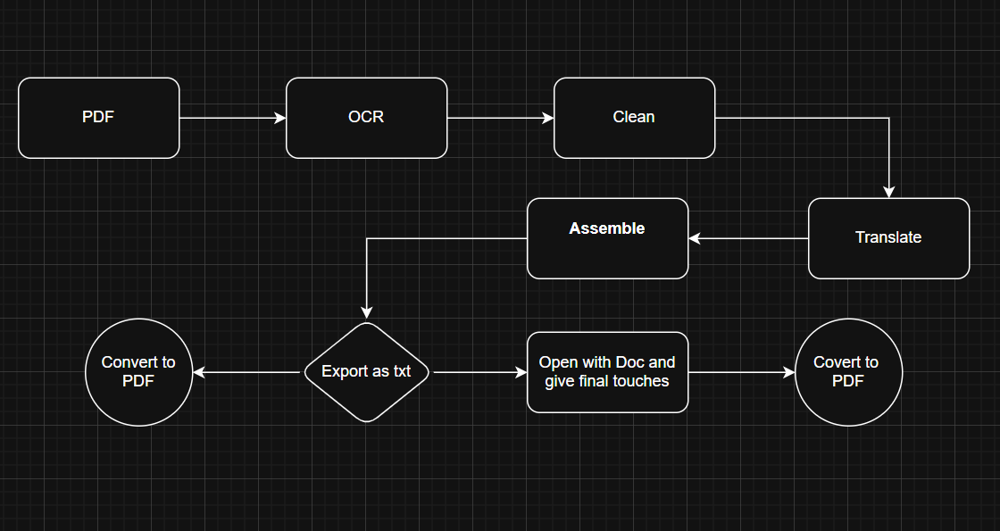
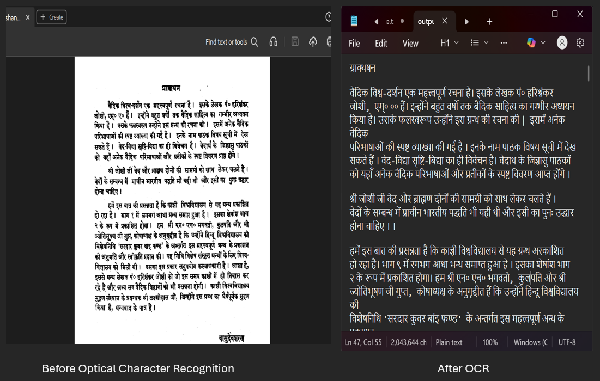
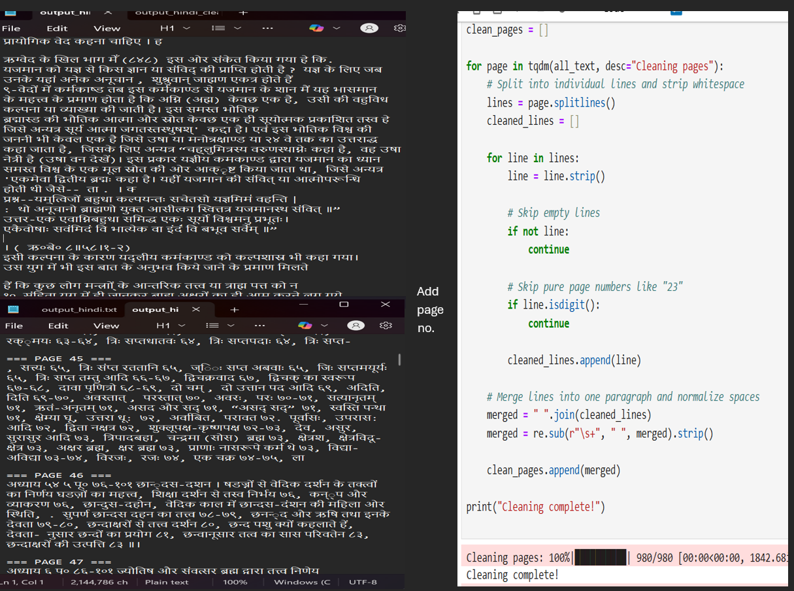
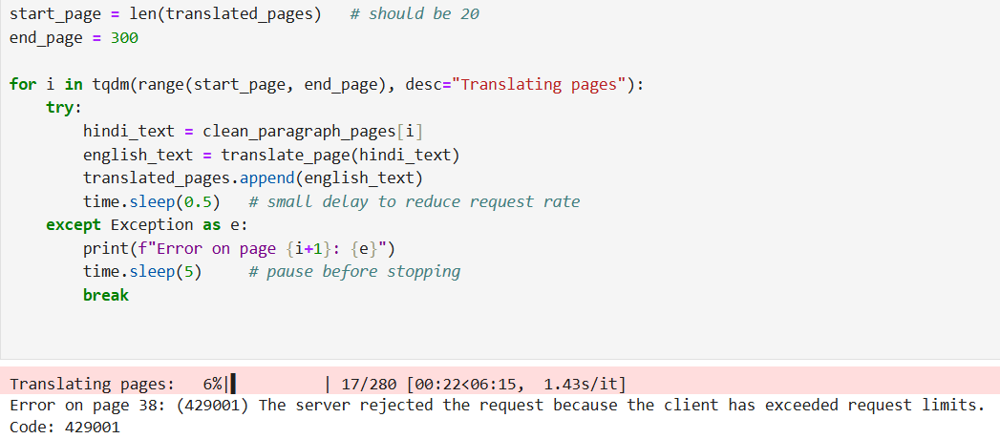
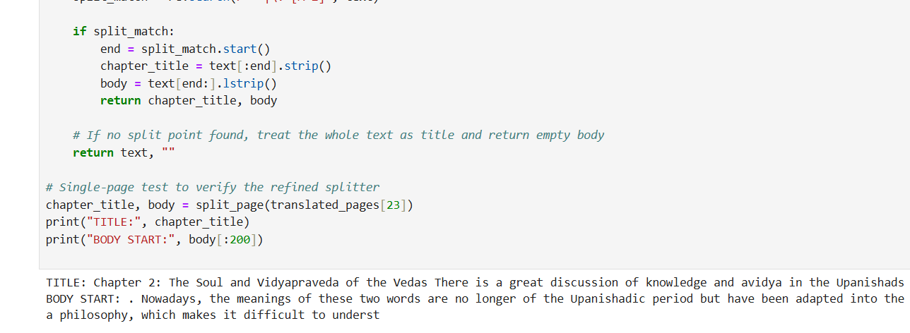
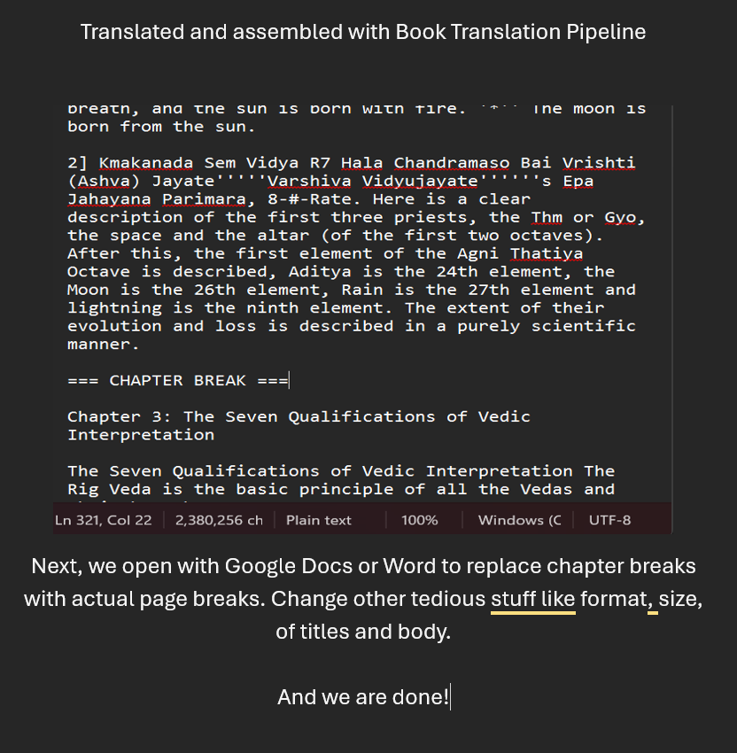

<h1>📚 Book Translation Pipeline – Project Overview</h1>

This project converts a scanned Hindi/Sanskrit book (PDF) into a cleaned, chapter‑aware English manuscript ready for final formatting and PDF export. The pipeline is built in a Jupyter notebook and designed for reproducibility, incremental runs, and safe handling of translation API limits.

 

<h1>🔎 Inputs & Outputs</h1>

<h4>Inputs</h4>

Scanned PDF (multi‑page, image scans).

Optional: human‑verified chapter index / known titles (used as overrides).

API credentials (Azure Translator or other) stored in a local .env file (never commit keys).

<h4>Primary Outputs</h4>

output_hindi.txt — raw OCR text (UTF‑8).

clean_paragraph_pages — list of cleaned page paragraphs.

translated_pages_partial.json — incremental translations (saved during runs).

final_book.txt — assembled, cleaned English manuscript with === CHAPTER BREAK === markers ready for Word/Google Docs.

 

<h1>🧭 High‑Level Pipeline</h1>

<h4>1. OCR & Image Conversion</h4>

Convert PDF pages to images using pdf2image (poppler).

Run OCR with pytesseract (Hindi/Sanskrit language packs).

Save raw OCR output to output_hindi.txt.

*Pipeline overview: how the notebook transforms scanned pages into the final manuscript.*
 
 
<h4>2. Paragraph‑Preserving Cleaning</h4>

Split OCR output into lines, remove page numbers and empty lines.
<h3>OCR sample before and after</h3>

*Raw scanned page (left) and OCR output (right) demonstrating typical OCR noise before cleaning.*
Merge lines into paragraphs using sentence terminators (e.g., ।, .).
 
 
Produce clean_paragraph_pages (one page → paragraphs separated by blank lines).

<h3>Paragraph cleaning</h3>

*Paragraph-preserving cleaning: lines merged into coherent paragraphs while preserving sentence boundaries.*

 
 
<h4>3. Translation (resumable & rate‑aware)</h4>

Translate pages using Azure Text Translation (or googletrans for quick tests).

Use a resumable translation runner that:

Saves progress after each page (translation_progress.json, translated_pages_partial.json).

Uses exponential backoff, jitter, and configurable delays to handle rate limits.

Processes in batches so runs are short and restartable.

Note: the robust resumable cell is provided and has not been executed in your environment — run conservatively first (small BATCH_SIZE, larger DELAY_SECONDS) to validate.

<h3>Translation progress</h3> 

*Resumable translation in action — progress and logs during a short test batch.*

 
 
<h4>4. Chapter Detection & Title Overrides</h4>

Extract candidate chapter numbers from the book index (front‑matter).

Normalize OCR artifacts (e.g., 47. → 4, 1.5 → 15).

Use detect_chapter_by_number to find pages that start chapters.

Apply KNOWN_TITLES mapping for human‑verified titles when available, and extract the remaining page body.
<h3>Chapter detection example</h3>

*Detected chapter title and the start of the extracted body after applying title overrides.*

<h4>5. English Cleaning & Assembly</h4>

Run a conservative clean_english() pass to:

Remove repeated words, collapse extra spaces, fix spacing before punctuation, and capitalize after newlines.

Insert === CHAPTER BREAK === markers before chapter starts.

Remove debug page markers and write final_book.txt (UTF‑8).

<h3>Final assembled text preview</h3> 

*Example cover for the final edits!.*

<h3>6. Manual Final Formatting</h3>

Open final_book.txt in Word or Google Docs (choose UTF‑8 encoding).

Replace === CHAPTER BREAK === with manual page breaks (Word: Find → Replace → Manual Page Break ^m).

Apply Heading styles to chapter titles, adjust fonts, margins, and export to PDF.

 

<h1>🛠️ Tech Stack</h1>

Python (Pandas, regex, pdf2image, pytesseract, Pillow, tqdm)
Azure Text Translation (or googletrans for quick tests)
Jupyter Notebook (annotated pipeline)
Optional: python-dotenv for secrets management

 

<h1>📁 Repository Layout (recommended)</h1>

notebooks/book_translation.ipynb — annotated notebook with experiments and production cells

src/ — optional reusable helpers (ocr_utils.py, translate_runner.py, assemble.py)

data/ — local PDFs (do not commit)

.env — local API keys (do not commit)

requirements.txt — dependencies

.gitignore — exclude large files and secrets

README.md — this file

 

<h1>⚙️ How to Run (quick start)</h1>

Clone the repo and create a virtual environment.

Install dependencies from requirements.txt.

Place your scanned PDF in data/ (do not commit).

Add translator API keys to .env.

Open notebooks/book_translation.ipynb and run cells in order:

Imports & environment checks

OCR demo (single page)

Full OCR extraction (creates output_hindi.txt)

Paragraph cleaning (clean_paragraph_pages)

Conservative resumable translation (run with BATCH_SIZE=10, DELAY_SECONDS=2.0 first)

Chapter detection & assembly

English cleaning and save final_book.txt

Open final_book.txt in Word/Google Docs (UTF‑8), replace chapter markers with page breaks, style, and export to PDF.

 

<h1>🖼️ Suggested Images / Screenshots to Add</h1>

Pipeline diagram (PDF → OCR → Clean → Translate → Assemble → Export) — place near the top.

OCR sample: scanned page image vs raw OCR text snippet (before cleaning).

Paragraph cleaning: notebook cell showing before/after paragraph merging.

Translation progress: tqdm progress screenshot during a short test run.

Chapter detection: example output showing detected chapter title and body preview.

Final text preview: snippet of final_book.txt showing === CHAPTER BREAK === markers.

Export mockup: simple cover image for the final PDF.

Add images to docs/images/ and reference them in the README with captions and alt text.

 

<h1>🧾 Final Export Checklist</h1>

Proofread chapter titles and first paragraphs for OCR/translation artifacts.

Replace === CHAPTER BREAK === with real page breaks in Word/Google Docs.

Apply Heading styles to chapter titles and generate a Table of Contents.

Export to PDF and verify fonts, page numbers, and layout.

 

<h1>📬 Contact</h1>

Created by Hishaam Khan Pathan  
✉️ hishaamp88@gmail.com
🔗 https://www.linkedin.com/in/hishaam-pathan-614175187/

 

<h1>📜 License</h1>
